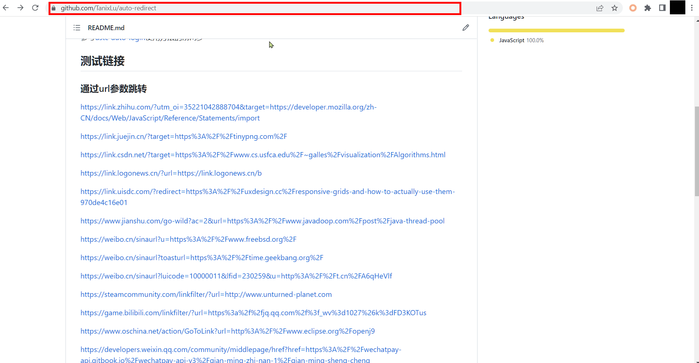

# auto-redirect

## 功能

跳过跳转提示页面，直达目的地：

## 使用方法

参考[ustc-auto-login](https://github.com/TanixLu/ustc-auto-login#:~:text=%E7%B3%BB%E7%BB%9F%E8%87%AA%E5%8A%A8%E7%99%BB%E5%BD%95-,%E4%BD%BF%E7%94%A8%E6%96%B9%E6%B3%95,-%E7%82%B9%E5%87%BB%E5%8F%B3%E4%BE%A7)使用方法的前两步。

## 原理

中间页面分为两种：

- 一种是可从URL获取到要跳转的地址，那么暂停页面的加载（`window.stop()`），从URL获取地址并跳转。

- 另一种是需要从页面内容中获取跳转地址（如t.cn类型），这种比较少，先在开始时将页面隐藏（`document.documentElement.setAttribute("hidden", "")`），然后在加载完的时候从页面中获取链接再跳转。

## 特点

与[Open-the-F-king-URL-Right-Now](https://github.com/OldPanda/Open-the-F-king-URL-Right-Now)相比：可从URL获取跳转目的地时，不加载中间页面加快了跳转；不能从URL直接获取目的地时，同样使页面为空白，减少了跳转时的视觉感知。

与[anti-redirect](https://github.com/axetroy/anti-redirect)相比：从任何网站打开的中间页面都能跳转，比如下面的测试链接，anti-redirect脚本不会处理，因为GitHub本来不会加跳转确认页面；另外有时候页面没加载完的时候就点击链接，anti-redirect可能还没处理，于是会进入中转页面。

## 反馈

如果有此插件不能跳转的页面，欢迎通过[issues](https://github.com/TanixLu/auto-redirect/issues)反馈，请附上不能跳转的中间页面链接，就像下面的测试链接那样。如有其他问题也欢迎通过issues反馈。

## 测试链接

### 通过URL参数跳转

https://link.zhihu.com/?utm_oi=35221042888704&target=https://developer.mozilla.org/zh-CN/docs/Web/JavaScript/Reference/Statements/import

https://link.juejin.cn/?target=https%3A%2F%2Ftinypng.com%2F

https://link.csdn.net/?target=https%3A%2F%2Fwww.cs.usfca.edu%2F~galles%2Fvisualization%2FAlgorithms.html

https://link.logonews.cn/?url=https://link.logonews.cn/b

https://link.uisdc.com/?redirect=https%3A%2F%2Fuxdesign.cc%2Fresponsive-grids-and-how-to-actually-use-them-970de4c16e01

https://www.jianshu.com/go-wild?ac=2&url=https%3A%2F%2Fwww.javadoop.com%2Fpost%2Fjava-thread-pool

https://weibo.cn/sinaurl?u=https%3A%2F%2Fwww.freebsd.org%2F

https://weibo.cn/sinaurl?toasturl=https%3A%2F%2Ftime.geekbang.org%2F

https://weibo.cn/sinaurl?luicode=10000011&lfid=230259&u=http%3A%2F%2Ft.cn%2FA6qHeVlf

https://steamcommunity.com/linkfilter/?url=http://www.unturned-planet.com

https://game.bilibili.com/linkfilter/?url=https%3a%2f%2fjq.qq.com%2f%3f_wv%3d1027%26k%3dFD3KOTus

https://www.oschina.net/action/GoToLink?url=http%3A%2F%2Fwww.eclipse.org%2Fopenj9

https://developers.weixin.qq.com/community/middlepage/href?href=https%3A%2F%2Fwechatpay-api.gitbook.io%2Fwechatpay-api-v3%2Fqian-ming-zhi-nan-1%2Fqian-ming-sheng-cheng

https://www.pixiv.net/jump.php?url=https://twitter.com/K2_illustration

https://www.chinaz.com/go.shtml?url=https://yuxiaoy.com

http://c.pc.qq.com/index.html?pfurl=https%3A%2F%2Fcj%2Esina%2Ecom%2Ecn%2Farticle%2Fnormal%5Fdetail%3Furl%3Dhttps%3A%2F%2Ffinance%2Esina%2Ecom%2Ecn%2Fchina%2F2019%2D02%2D20%2Fdoc%2Dihqfskcp7002203%2Eshtml&pfuin=38582230&pfto=qq.msg&type=61000&gjlevel=14&gjsublevel=167

https://c.pc.qq.com/middlem.html?pfurl=https%3A%2F%2Fwww%2Eboyunso%2Ecom%2F&pfuin=0&pfto=&type=0&gjlevel=15&gjsublevel=2804&iscontinue=0https://scanzrai0.ktweabac.com/f/XaEHUXRR65WHQL0

https://www.yuque.com/r/goto?url=https://www.runningcheese.com

https://www.mcbbs.net/plugin.php?id=link_redirect&target=http%3a%2f%2fwwwi.odnoklassniki-film.ru

http://www.360doc.cn/outlink.html?url=http://www.securelist.com/en/advisories/41167

https://www.tianyancha.com/security?target=http%3A%2F%2Fwww.hnreal.net

https://afdian.net/link?target=https%3A%2F%2Fgithub.com%2Fgithub%2Fdmca%2Fblob%2Fmaster%2F2022%2F08%2F2022-08-09-plain-craft-launcher-2.md

https://en.mail.qq.com/cgi-bin/readtemplate?t=safety&check=false&gourl=https%3A%2F%2Fusers.rust-lang.org%2F&subtemplate=gray&evil=0

https://gitee.com/link?target=http%3A%2F%2Fwww.ue360.net%2Fworkflow.html

https://xie.infoq.cn/link?target=https%3A%2F%2Fgithub.com%2Fshaoxiongdu%2Fjava-notes

https://leetcode.cn/link/?target=https://www.hello-algo.com

https://blog.51cto.com/transfer?http://www.msfn.org/

https://www.coolapk.com/link?url=https%3A%2F%2Fpan.lanzouv.com%2Fb0f1gnb3a

https://ref.gamer.com.tw/redir.php?url=https%3A%2F%2Fwww.facebook.com%2Ftos.zh%2F%3Ffref%3Dnf

https://minecraft.curseforge.com/linkout?remoteUrl=http%253a%252f%252fci.tterrag.com%252fjob%252fEnderIO-Modules%252fjob%252fEnderIO-Combined%252f33%252fchanges

https://docs.qq.com/scenario/link.html?url=https%3A%2F%2Fm.tb.cn%2Fh.USHBypD%3Ftk%3DyeSfd2qxzFC

https://en.mail.qq.com/cgi-bin/readtemplate?t=safety&check=false&gourl=https%3A%2F%2Fclick.pstmrk.it%2F2sm%2Fsms-activate.org%252Fapi%252Fapi.php%253Fact%253Dconfirm%2526confirm%253D71200c0ba17a07061ab45ff48de5f6d9%2526email%253Dtanixlu%2540foxmail.com%2F0tcQ2zQN%2FMol8%2FETbbB8jgoo%2FdGVtcGxhdGVJZF8x&subtemplate=gray&evil=0

### 通过网页内容跳转

http://t.cn/RgAKoPE

http://jump.bdimg.com/safecheck/index?url=x+Z5mMbGPAvXDng2oqWAVmR+1hW7aPqAOMkvpHqWTTlU/cLqLLC/M1e7OIME60GmAJITlPIAUlei08CqSp0lVwRoRAL3wqh1myQ4XFJS7UoPq8kdRnF84Xij/Kd8UV9vhuhqENgybj1iZVqnaH0n7PveDvtG9g02dj2oeHoEzTI=

http://iphone.myzaker.com/zaker/link.php?pk=633f6a5432ce403638000008&b=aHR0cHM6Ly93d3cuY2hpbmFuZXdzLmNvbS5jbi8=&bcode=31e98f88&target=_new

*部分网站来自[Open-the-F-king-URL-Right-Now](https://github.com/OldPanda/Open-the-F-king-URL-Right-Now/blob/master/userscript.js)*
